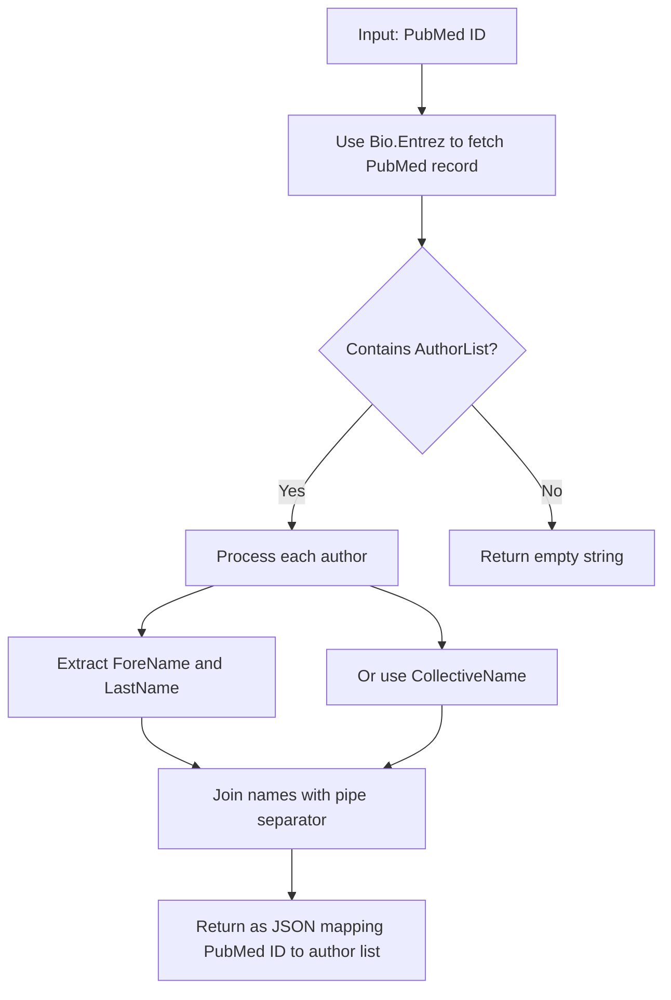
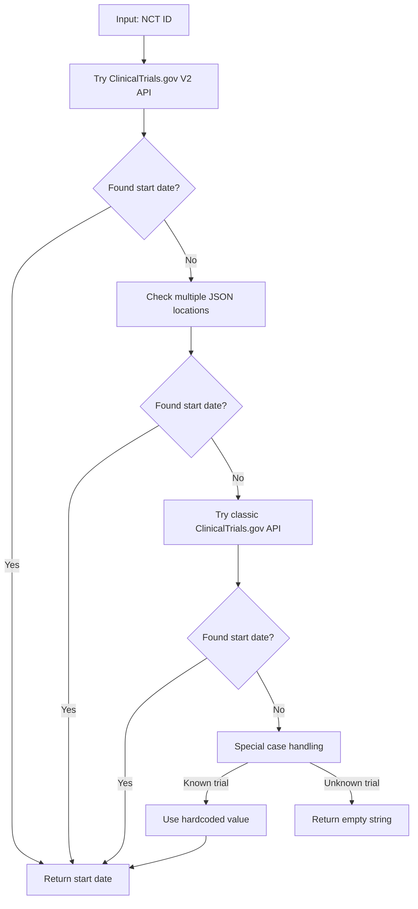
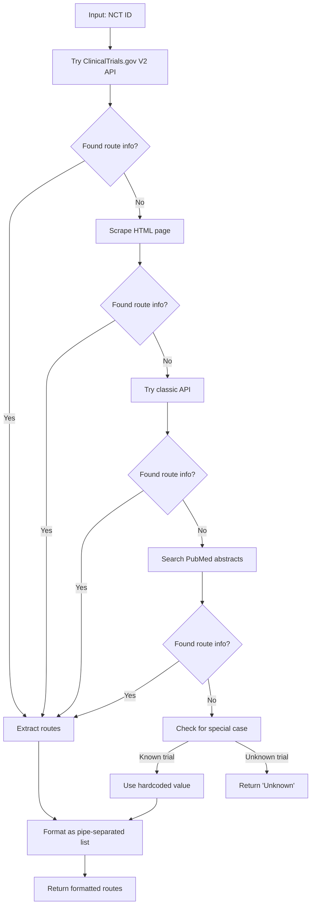

# HemOnc Bench


> **Extract, enrich, and analyze clinical trial data with ease**

HemOnc Bench is a Python tool designed to construct a robust DeepResearch benchmark for clinical trial data extraction and enrichment. It automatically fetches detailed information from ClinicalTrials.gov and PubMed, transforming basic trial identifiers into rich, research-ready tables. The tool is designed for resilience, accuracy, and ease of use, making it ideal for clinicians, researchers, and data scientists.

---

## Features

- **Automated data enrichment**: Add author lists, study timelines, outcome measures, drug routes, and drug classes to your datasets.
- **Robust extraction logic**: Multi-layered approach ensures maximum data recovery, even for older or incomplete records.
- **User-friendly**: Simple installation and operation, with clear output formats.

---

## Table of Extracted Data

| Column                    | Description                                      |
| ------------------------- | ------------------------------------------------ |
| `authors`               | JSON mapping PubMed IDs to author lists          |
| `start_date`            | Clinical trial start date from registry          |
| `has_primary_outcome`   | Whether the trial has primary outcome measures   |
| `has_secondary_outcome` | Whether the trial has secondary outcome measures |
| `drug_routes`           | Administration routes of drugs used in the trial |
| `drug_classes`          | Classification of drugs used in the trial        |

---

## Installation

1. **Clone the repository:**
   ```bash
   git clone https://github.com/yourusername/hemonc_bench.git
   cd hemonc_bench
   ```
2. **Install dependencies:**
   ```bash
   pip install -r requirements.txt
   ```

---

## Main Input File

**Use this as your primary input:**

- `data/Hemonc_new_with_all.csv`

---

## Running the Main Processing Script

The main script for processing NCT predictions is:

```bash
python process_NCT_predictions.py --csv_path data/Hemonc_new_with_all.csv --output_path <your_output.csv> [--model <model_name>] [--use_tools] [--max_workers N]
```

- `--csv_path` (required): Path to your input CSV file (default: `data/Hemonc_new_with_all.csv`)
- `--output_path`: Path to save the output CSV
- `--model`: Model to use (default: `gemini-2.0-flash`)
- `--use_tools`: Enable Google Search tool (optional)
- `--max_workers`: Number of parallel threads (default: 4)

Example:

```bash
python process_NCT_predictions.py --csv_path data/Hemonc_new_with_all.csv --output_path results.csv
```

---

## Helper Functions (`random_helper`)

The `random_helper` directory contains reusable utilities and scripts for:

- Downloading and preprocessing NCT data (`download_nct_data.py`)
- Extracting NCT numbers from evidence columns (`process_NCT_dataset.py`)
- Processing model predictions and results (`process_predictions.py`)
- PubMed utilities (`pubmed_utils.py`)
- Data exploration and cleaning notebooks (various `.ipynb` files)

These scripts help with data preparation, cleaning, and intermediate analysis.

---

## Data Extraction Methods (Simplified)

This project uses a robust, multi-step approach to extract detailed information for each clinical trial:

### 1. Author Extraction (PubMed)

- Retrieves author lists for each PubMed ID using the Bio.Entrez API.
- Handles missing names and collective authors.
- Output: JSON mapping PubMed ID to a pipe-separated author list.

### 2. NCT ID Extraction

- Scans PubMed records for NCT IDs using regex (`NCT\d{8}`).
- Searches all relevant fields (identifiers, titles, abstracts, MeSH).

### 3. Study Start Date

- Attempts to fetch the start date from multiple locations in ClinicalTrials.gov APIs.
- Falls back to pattern matching and special-case handling for older trials.

### 4. Outcome Measures

- Checks for the presence of primary and secondary outcome arrays in the trial record.
- Returns simple Yes/No indicators.

### 5. Drug Administration Routes

- Extracts drug administration routes from APIs, HTML pages, or PubMed abstracts.
- Uses pattern matching for terms like "oral", "IV", "subcutaneous", etc.

### 6. Drug Classifications

- Maps drug names and keywords to a comprehensive set of classes (e.g., PD-1 inhibitor, kinase inhibitor).
- Output: Pipe-separated list of identified drug classes.

---

If you have questions or need more detail on any step, see the code comments or helper scripts in `random_helper`.

## Data Extraction Methods

The following summarizes how HemOnc Bench extracts and enriches clinical trial data:

### 1. Author Extraction

- For each PubMed ID, fetches author information using the NCBI Entrez API.
- Builds a JSON mapping of PubMed IDs to a pipe-separated list of authors (e.g., `"John Smith|Jane Doe"`).
- Handles missing names and collective author groups robustly.

### 2. NCT ID Extraction

- Scans PubMed records for NCT IDs using the regex pattern `NCT\d{8}`.
- Searches all likely fields, including identifiers, titles, abstracts, and MeSH terms.
- Returns the first valid match found.

### 3. Study Start Date

- Attempts to extract the start date from ClinicalTrials.gov using the V2 API, which returns detailed trial records as nested JSON.
- Checks several possible JSON paths (e.g., `protocolSection/statusModule/startDateStruct/date`) because ClinicalTrials.gov has changed its schema over time and start dates may be stored in different locations for different trials.
- If none of the standard paths are found, the code searches the entire JSON for any field named "startDate" as a fallback.
- If still not found, falls back to the classic API or uses hardcoded/special-case logic for known trials.
- These JSON paths are determined by inspecting real ClinicalTrials.gov API responses. You can see them by downloading a trial's JSON from ClinicalTrials.gov and looking at its structure.
- This approach ensures compatibility across different data vintages and registry formats.

### 4. Outcome Measures

- Checks if primary and secondary outcome arrays exist in the trial data.
- Returns simple "Yes" or "No" values for each outcome type.
- Falls back to alternate APIs or special handling if needed.

### 5. Drug Administration Routes

- Extracts drug administration routes from ClinicalTrials.gov APIs or, if necessary, scrapes the ClinicalTrials.gov HTML page or searches PubMed abstracts.
- Uses pattern matching to identify common routes (e.g., oral, intravenous, subcutaneous, intramuscular).
- Returns a pipe-separated list of routes.

### 6. Drug Classifications

- Maps drug names and keywords to a curated set of drug classes (e.g., PD-1 inhibitor, kinase inhibitor, immunotherapy, etc.).
- Uses both direct name matching and keyword detection for comprehensive coverage.
- Returns a pipe-separated list of all identified classes for each trial.

---

For more details or technical specifics, see the code comments and helper scripts in the `random_helper` directory.

### 👥 Author Information

<details>
<summary><b>How author data is extracted</b> (click to expand)</summary>



- **Primary Source**: PubMed API via Bio.Entrez
- **Format**: Pipe-separated list (e.g., `"John Smith|Jane Doe"`)
- **Resilience**: Falls back to `LastName` only if `ForeName` is missing; handles collective author names

</details>

### NCT ID Extraction

<details>
<summary><b>How NCT IDs are extracted from PubMed</b> (click to expand)</summary>

- **Process**:

  1. Fetch full XML record for a PubMed ID
  2. Apply regex pattern matching: `NCT\d{8}`
  3. Return first match if found
- **Why This Approach?**
  NCT IDs can appear in various locations in PubMed records:

  - Secondary identifier fields
  - Article titles
  - Abstracts
  - MeSH terms

  Regex pattern matching provides the most comprehensive way to find these IDs regardless of their location.

</details>

### Study Start Date

<details>
<summary><b>Multi-layered extraction of start dates</b> (click to expand)</summary>



- **Primary Method**: ClinicalTrials.gov V2 API
- **JSON Locations Checked**:

  1. `protocolSection/statusModule/startDateStruct/date`
  2. `protocolSection/statusModule/startDate`
  3. `protocolSection/designModule/studyStartDateStruct/date`
  4. `protocolSection/designModule/studyStartDate`
  5. `derivedSection/startDateStruct/date`
  6. `derivedSection/startDate`
  7. Pattern matching for any `"startDate"` field
- **Why So Complex?**
  The ClinicalTrials.gov data structure has evolved over time, with older trials having different formats. This comprehensive approach ensures maximum data recovery across all trial vintages.

</details>

### Primary & Secondary Outcome Measures

<details>
<summary><b>Outcome measure detection strategy</b> (click to expand)</summary>

- **Primary Method**: Check for array existence

  - Primary outcomes: `protocolSection/outcomesModule/primaryOutcomes`
  - Secondary outcomes: `protocolSection/outcomesModule/secondaryOutcomes`
- **Output**: Simple "Yes" or "No"
- **Fallback Chain**:

  1. V2 API → 2. Classic API → 3. Special case handling
- **Practical Impact**:
  Having this information helps researchers quickly identify trials with well-defined outcome measurements, an important factor in assessing study quality.

</details>

### Drug Administration Routes

<details>
<summary><b>How drug routes are determined</b> (click to expand)</summary>



- **Pattern Matching**: Text analysis for terms like:

  - "oral"
  - "intravenous"/"i.v."
  - "subcutaneous"/"s.c."
  - "intramuscular"/"i.m."
  - And many more
- **Why This Matters**:
  Administration route affects drug bioavailability, patient convenience, and compliance. This information helps researchers understand critical aspects of treatment protocols.

</details>

### Drug Classifications

<details>
<summary><b>Intelligent drug classification system</b> (click to expand)</summary>

- **Two-Pronged Approach**:

  1. **Drug Name Matching**: Maps specific drug names to classes

     ```
     pembrolizumab → PD-1 Inhibitor
     atezolizumab → PD-L1 Inhibitor
     ipilimumab → CTLA-4 Inhibitor
     ```
  2. **Keyword Detection**: Identifies class by terminology

     ```
     "pd-1" → PD-1 Inhibitor
     "kinase" → Kinase Inhibitor
     "immunotherapy" → Immunotherapy
     ```
- **Comprehensive Classification Dictionary**:

  - PD-1 Inhibitors
  - PD-L1 Inhibitors
  - CTLA-4 Inhibitors
  - Anti-VEGF agents
  - Tyrosine Kinase Inhibitors
  - EGFR Inhibitors
  - Platinum-based Chemotherapy
  - Taxanes
  - Antimetabolites
  - Immunomodulatory Drugs
  - Corticosteroids
  - BTK Inhibitors
  - CDK4/6 Inhibitors
  - PARP Inhibitors
  - mTOR Inhibitors
  - Proteasome Inhibitors
- **Output Format**: Pipe-separated list of identified classes
