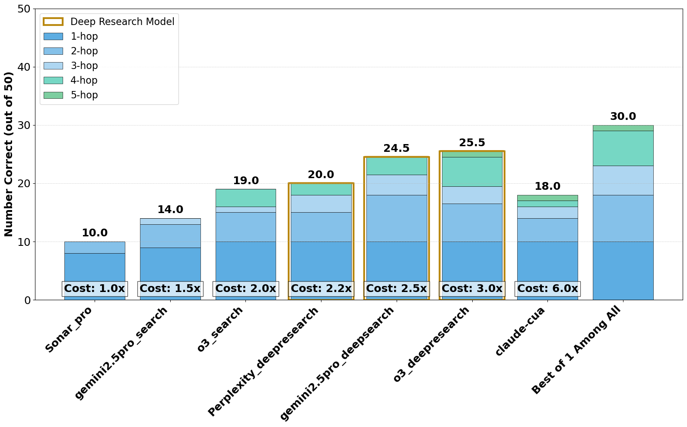
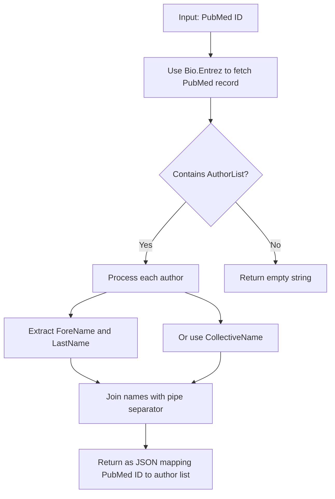
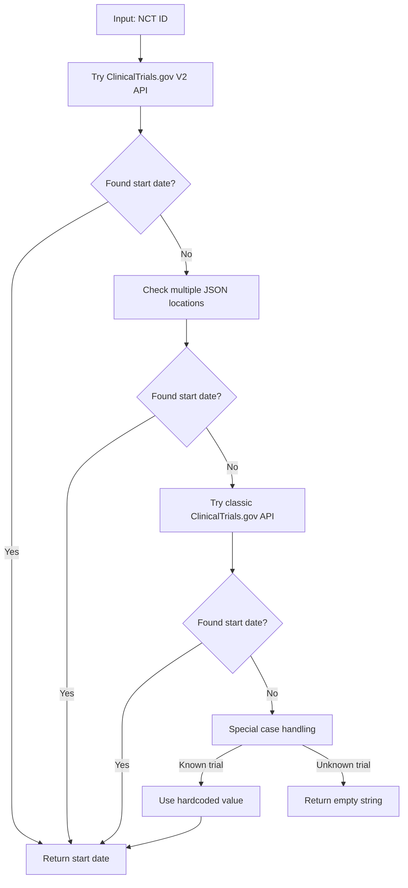
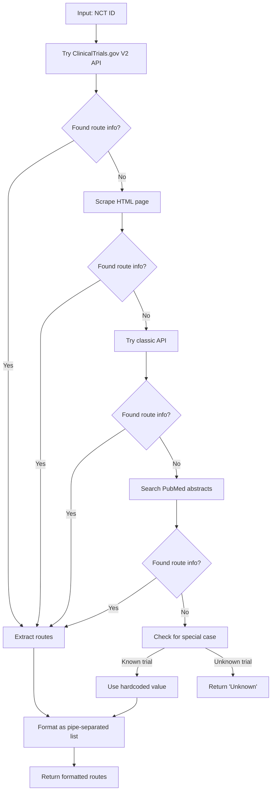

# MedBrowseComp


[](https://huggingface.co/collections/AIM-Harvard/medbrowsecomp-6822637df90521b5d8b8b23f)

Large language models are increasingly envisioned as decision-support tools in clinical practice, yet safe clinical reasoning demands the integration of heterogeneous knowledge bases—trials, primary studies, regulatory documents, and cost data— under strict accuracy constraints. Existing evaluations typically rely on synthetic prompts, reduce the task to single-hop factoid queries, or conflate reasoning with open-ended text generation, leaving their real-world utility unclear. To close this gap, we present MedBrowseComp, the first benchmark that systematically tests an agent’s ability to reliably retrieve and synthesize multi-hop medical facts from live, domain-specific knowledge bases. MedBrowseComp holds 1,000+ human-curated questions that mirror clinical scenarios in which practitioners must reconcile fragmented or conflicting information to reach an up-to-date conclusion. Applying MedBrowseComp to frontier agentic systems reveals marked performance shortfalls as low as 10. These findings expose a critical gap between current LLM capabilities and the rigor demanded in clinical settings. MedBrowseComp exposes the strengths and weaknesses of current agentic systems, offering a testbed for reliable medical information seeking and clear goals for future model and toolchain upgrades.

## Performance Results


## Installation

1. **Clone the repository:**
   ```bash
   git clone https://github.com/yourusername/hemonc_bench.git
   cd hemonc_bench
   ```
2. **Install dependencies:**
   ```bash
   pip install -r requirements.txt
   ```

---

## Final Benchmark Data

This repository provides two main benchmark datasets (they are encode to avoid training on test set, read the next section on how to decode them!)):

- `data/final50.csv` (**MedBrowseComp50**):
  - 50 curated clinical trial samples for rapid evaluation and demonstration.
- `data/final121.csv` (**MedBrowseComp605**):
  - 605 clinical trial samples for comprehensive benchmarking.

Use these files as your primary input for all evaluation and processing tasks.

---

## Data File Encoding/Decoding

To help prevent accidental data contamination during model training, you can encode the data files before sharing or uploading. Multiple encoding methods are supported:

### 1. Per-Cell Combo Encoding (Recommended)

Each cell is first shifted (by a configurable value), then base64 encoded. The output is a valid CSV file, but the contents are not human-readable.

**Encode:**

```bash
python data/encode_decode.py cell-encode-combo data/final50.csv --shift 3
# Produces: data/final50_cell_combo_shift3_b64.csv
```

**Decode:**

```bash
python data/encode_decode.py cell-decode-combo data/final50_cell_combo_shift3_b64.csv --shift 3
# Produces: data/final50.csv
```

- All encoded/decoded files always end with `.csv` and use underscores for suffixes.
- This is the recommended method for sharing, archiving, and HuggingFace upload.

### 2. Per-Cell Base64 or Shift Encoding

You can also encode/decode each cell using only base64 or only a shift:

**Base64:**

```bash
python data/encode_decode.py cell-encode data/final50.csv --method base64
# Produces: data/final50_cell_base64.csv
python data/encode_decode.py cell-decode data/final50_cell_base64.csv --method base64
# Produces: data/final50.csv
```

**Shift:**

```bash
python data/encode_decode.py cell-encode data/final50.csv --method shift --shift 3
# Produces: data/final50_cell_shift3.csv
python data/encode_decode.py cell-decode data/final50_cell_shift3.csv --method shift --shift 3
# Produces: data/final50.csv
```

---

## Setting Up API Keys

Some features require API keys for Gemini, OpenAI, or Sonar (Perplexity). Copy `.env.example` to `.env` and add your keys:

```bash
cp .env.example .env
```

Edit `.env` and fill in your API keys:

```
GEMINI_API_KEY=your_gemini_api_key_here
OPENAI_API_KEY=your_openai_api_key_here
SONAR_API_KEY=your_sonar_api_key_here
```

---

## Running the Main Processing Script

The main script for processing predictions is:

```bash
python process_NCT_predictions.py --csv_path data/final50.csv --output_path results50.csv --model gemini-2.0-flash
```

For the larger benchmark:

```bash
python process_NCT_predictions.py --csv_path data/final121.csv --output_path results605.csv --model gemini-2.0-flash
```

You may also specify other models (e.g., OpenAI or Sonar), and use additional flags:

- `--use_tools`: Enable Google Search tool (optional)
- `--max_workers N`: Number of parallel threads (default: 4)

Example with all options:

```bash
python process_NCT_predictions.py --csv_path data/final121.csv --output_path results605.csv --model openai-gpt-4 --use_tools --max_workers 8
```

---

- `--csv_path` (required): Path to your input CSV file (default: `data/Hemonc_new_with_all.csv`)
- `--output_path`: Path to save the output CSV
- `--model`: Model to use (default: `gemini-2.0-flash`)
- `--use_tools`: Enable Google Search tool (optional)
- `--max_workers`: Number of parallel threads (default: 4)

Example:

```bash
python process_NCT_predictions.py --csv_path data/Hemonc_new_with_all.csv --output_path results.csv
```

---

## LLM-Based Calibration Evaluation (Optional)

You can now run a post-hoc LLM-based evaluation of model outputs to assess calibration and correctness using state-of-the-art language models (Gemini or OpenAI). This is entirely optional and does not affect the main regex/extraction-based pipeline.

### Script: `process_NCT_llm_calibration.py`

- **Purpose**: For each prediction, uses an LLM to judge correctness and extract a confidence score, following the RMS calibration error metric from Hendrycks et al.
- **Supported Models**: All Gemini models, all OpenAI models ("-search-preview" suffix handled automatically). Sonar models are NOT supported for LLM judge evaluation.
- **Output**: A new CSV with columns for question, correct_answer, model_output, LLM-extracted answer, LLM judgment (correct/incorrect), LLM confidence, LLM reasoning, and the original regex correctness. Also computes and logs RMS calibration error.

#### Usage Example

First, run your main pipeline as usual:

```bash
python process_NCT_predictions.py --csv_path data/Hemonc_new_with_all.csv --output_path results.csv
```

Then, run the LLM calibration script:

```bash
python process_NCT_llm_calibration.py --input_csv results.csv --output_csv llm_judge_results.csv --model gemini-2.0-pro
```

Or for OpenAI:

```bash
python process_NCT_llm_calibration.py --input_csv results.csv --output_csv llm_judge_results.csv --model gpt-4-turbo
```

- The script will log the RMS calibration error and save detailed LLM judgments to the output CSV.
- The main regex/extraction logic is NOT affected—this is a supplemental evaluation.

---

## Citation

If you use this dataset in your research, please cite: https://arxiv.org/abs/2505.14963

```
@misc{chen2025medbrowsecompbenchmarkingmedicaldeep,
      title={MedBrowseComp: Benchmarking Medical Deep Research and Computer Use}, 
      author={Shan Chen and Pedro Moreira and Yuxin Xiao and Sam Schmidgall and Jeremy Warner and Hugo Aerts and Thomas Hartvigsen and Jack Gallifant and Danielle S. Bitterman},
      year={2025},
      eprint={2505.14963},
      archivePrefix={arXiv},
      primaryClass={cs.CL},
      url={https://arxiv.org/abs/2505.14963}, 
}
```
---

## Helper Functions (`random_helper`)

The `random_helper` directory contains reusable utilities and scripts for:

- Downloading and preprocessing NCT data (`download_nct_data.py`)
- Extracting NCT numbers from evidence columns (`process_NCT_dataset.py`)
- Processing model predictions and results (`process_predictions.py`)
- PubMed utilities (`pubmed_utils.py`)
- Data exploration and cleaning notebooks (various `.ipynb` files)

These scripts help with data preparation, cleaning, and intermediate analysis.

---

## Data Extraction Methods (Simplified)

This project uses a robust, multi-step approach to extract detailed information for each clinical trial:

### 1. Author Extraction (PubMed)

- Retrieves author lists for each PubMed ID using the Bio.Entrez API.
- Handles missing names and collective authors.
- Output: JSON mapping PubMed ID to a pipe-separated author list.

### 2. NCT ID Extraction

- Scans PubMed records for NCT IDs using regex (`NCT\d{8}`).
- Searches all relevant fields (identifiers, titles, abstracts, MeSH).

### 3. Study Start Date

- Attempts to fetch the start date from multiple locations in ClinicalTrials.gov APIs.
- Falls back to pattern matching and special-case handling for older trials.

### 4. Outcome Measures

- Checks for the presence of primary and secondary outcome arrays in the trial record.
- Returns simple Yes/No indicators.

### 5. Drug Administration Routes

- Extracts drug administration routes from APIs, HTML pages, or PubMed abstracts.
- Uses pattern matching for terms like "oral", "IV", "subcutaneous", etc.

### 6. Drug Classifications

- Maps drug names and keywords to a comprehensive set of classes (e.g., PD-1 inhibitor, kinase inhibitor).
- Output: Pipe-separated list of identified drug classes.

---

If you have questions or need more detail on any step, see the code comments or helper scripts in `random_helper`.

## Data Extraction Methods

The following summarizes how HemOnc Bench extracts and enriches clinical trial data:

### 1. Author Extraction

- For each PubMed ID, fetches author information using the NCBI Entrez API.
- Builds a JSON mapping of PubMed IDs to a pipe-separated list of authors (e.g., `"John Smith|Jane Doe"`).
- Handles missing names and collective author groups robustly.

### 2. NCT ID Extraction

- Scans PubMed records for NCT IDs using the regex pattern `NCT\d{8}`.
- Searches all likely fields, including identifiers, titles, abstracts, and MeSH terms.
- Returns the first valid match found.

### 3. Study Start Date

- Attempts to extract the start date from ClinicalTrials.gov using the V2 API, which returns detailed trial records as nested JSON.
- Checks several possible JSON paths (e.g., `protocolSection/statusModule/startDateStruct/date`) because ClinicalTrials.gov has changed its schema over time and start dates may be stored in different locations for different trials.
- If none of the standard paths are found, the code searches the entire JSON for any field named "startDate" as a fallback.
- If still not found, falls back to the classic API or uses hardcoded/special-case logic for known trials.
- These JSON paths are determined by inspecting real ClinicalTrials.gov API responses. You can see them by downloading a trial's JSON from ClinicalTrials.gov and looking at its structure.
- This approach ensures compatibility across different data vintages and registry formats.

### 4. Outcome Measures

- Checks if primary and secondary outcome arrays exist in the trial data.
- Returns simple "Yes" or "No" values for each outcome type.
- Falls back to alternate APIs or special handling if needed.

### 5. Drug Administration Routes

- Extracts drug administration routes from ClinicalTrials.gov APIs or, if necessary, scrapes the ClinicalTrials.gov HTML page or searches PubMed abstracts.
- Uses pattern matching to identify common routes (e.g., oral, intravenous, subcutaneous, intramuscular).
- Returns a pipe-separated list of routes.

### 6. Drug Classifications

- Maps drug names and keywords to a curated set of drug classes (e.g., PD-1 inhibitor, kinase inhibitor, immunotherapy, etc.).
- Uses both direct name matching and keyword detection for comprehensive coverage.
- Returns a pipe-separated list of all identified classes for each trial.

---

For more details or technical specifics, see the code comments and helper scripts in the `random_helper` directory.

### 👥 Author Information

<details>
<summary><b>How author data is extracted</b> (click to expand)</summary>



- **Primary Source**: PubMed API via Bio.Entrez
- **Format**: Pipe-separated list (e.g., `"John Smith|Jane Doe"`)
- **Resilience**: Falls back to `LastName` only if `ForeName` is missing; handles collective author names

</details>

### NCT ID Extraction

<details>
<summary><b>How NCT IDs are extracted from PubMed</b> (click to expand)</summary>

- **Process**:

  1. Fetch full XML record for a PubMed ID
  2. Apply regex pattern matching: `NCT\d{8}`
  3. Return first match if found
- **Why This Approach?**
  NCT IDs can appear in various locations in PubMed records:

  - Secondary identifier fields
  - Article titles
  - Abstracts
  - MeSH terms

  Regex pattern matching provides the most comprehensive way to find these IDs regardless of their location.

</details>

### Study Start Date

<details>
<summary><b>Multi-layered extraction of start dates</b> (click to expand)</summary>



- **Primary Method**: ClinicalTrials.gov V2 API
- **JSON Locations Checked**:

  1. `protocolSection/statusModule/startDateStruct/date`
  2. `protocolSection/statusModule/startDate`
  3. `protocolSection/designModule/studyStartDateStruct/date`
  4. `protocolSection/designModule/studyStartDate`
  5. `derivedSection/startDateStruct/date`
  6. `derivedSection/startDate`
  7. Pattern matching for any `"startDate"` field
- **Why So Complex?**
  The ClinicalTrials.gov data structure has evolved over time, with older trials having different formats. This comprehensive approach ensures maximum data recovery across all trial vintages.

</details>

### Primary & Secondary Outcome Measures

<details>
<summary><b>Outcome measure detection strategy</b> (click to expand)</summary>

- **Primary Method**: Check for array existence

  - Primary outcomes: `protocolSection/outcomesModule/primaryOutcomes`
  - Secondary outcomes: `protocolSection/outcomesModule/secondaryOutcomes`
- **Output**: Simple "Yes" or "No"
- **Fallback Chain**:

  1. V2 API → 2. Classic API → 3. Special case handling
- **Practical Impact**:
  Having this information helps researchers quickly identify trials with well-defined outcome measurements, an important factor in assessing study quality.

</details>

### Drug Administration Routes

<details>
<summary><b>How drug routes are determined</b> (click to expand)</summary>



- **Pattern Matching**: Text analysis for terms like:

  - "oral"
  - "intravenous"/"i.v."
  - "subcutaneous"/"s.c."
  - "intramuscular"/"i.m."
  - And many more
- **Why This Matters**:
  Administration route affects drug bioavailability, patient convenience, and compliance. This information helps researchers understand critical aspects of treatment protocols.

</details>

### Drug Classifications

<details>
<summary><b>Intelligent drug classification system</b> (click to expand)</summary>

- **Two-Pronged Approach**:

  1. **Drug Name Matching**: Maps specific drug names to classes

     ```
     pembrolizumab → PD-1 Inhibitor
     atezolizumab → PD-L1 Inhibitor
     ipilimumab → CTLA-4 Inhibitor
     ```
  2. **Keyword Detection**: Identifies class by terminology

     ```
     "pd-1" → PD-1 Inhibitor
     "kinase" → Kinase Inhibitor
     "immunotherapy" → Immunotherapy
     ```
- **Comprehensive Classification Dictionary**:

  - PD-1 Inhibitors
  - PD-L1 Inhibitors
  - CTLA-4 Inhibitors
  - Anti-VEGF agents
  - Tyrosine Kinase Inhibitors
  - EGFR Inhibitors
  - Platinum-based Chemotherapy
  - Taxanes
  - Antimetabolites
  - Immunomodulatory Drugs
  - Corticosteroids
  - BTK Inhibitors
  - CDK4/6 Inhibitors
  - PARP Inhibitors
  - mTOR Inhibitors
  - Proteasome Inhibitors
- **Output Format**: Pipe-separated list of identified classes
