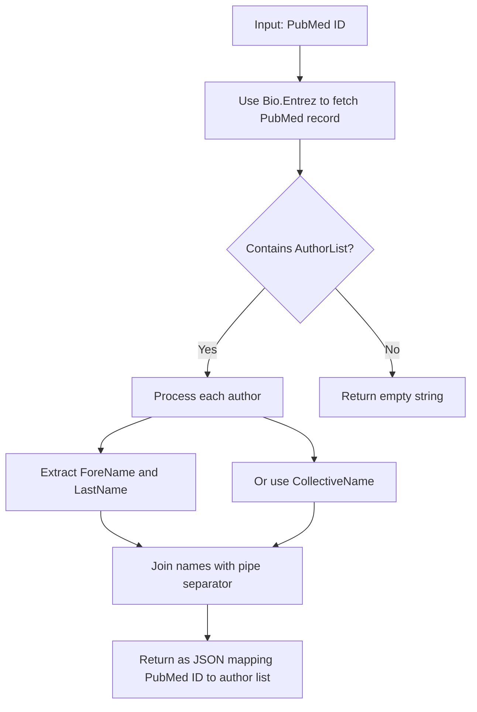
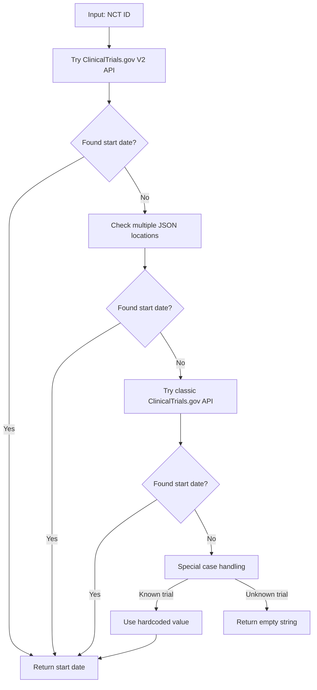

# hemonc_bench

# Data Extraction 


> *Extracting valuable clinical trial information with a multi-layered, resilient approach*

This script enhances clinical trial datasets by fetching comprehensive information from ClinicalTrials.gov and PubMed APIs. It transforms basic trial identifiers into rich datasets containing author information, study timelines, outcome details, and drug-specific data.

## Overview

The script adds the following columns to your dataframe:

| Column | Description |
|--------|-------------|
| `authors` | JSON-formatted string mapping PubMed IDs to author lists |
| `start_date` | Clinical trial start date from registry |
| `has_primary_outcome` | Whether the trial has primary outcome measures |
| `has_secondary_outcome` | Whether the trial has secondary outcome measures |
| `drug_routes` | Administration routes of drugs used in the trial |
| `drug_classes` | Classification of drugs used in the trial |

## Data Extraction Methods

### 👥 Author Information

<details>
<summary><b>How author data is extracted</b> (click to expand)</summary>



- **Primary Source**: PubMed API via Bio.Entrez
- **Format**: Pipe-separated list (e.g., `"John Smith|Jane Doe"`)
- **Resilience**: Falls back to `LastName` only if `ForeName` is missing; handles collective author names

</details>

### NCT ID Extraction

<details>
<summary><b>How NCT IDs are extracted from PubMed</b> (click to expand)</summary>

- **Process**:
  1. Fetch full XML record for a PubMed ID
  2. Apply regex pattern matching: `NCT\d{8}`
  3. Return first match if found

- **Why This Approach?** 
  NCT IDs can appear in various locations in PubMed records:
  - Secondary identifier fields
  - Article titles
  - Abstracts
  - MeSH terms
  
  Regex pattern matching provides the most comprehensive way to find these IDs regardless of their location.

</details>

### Study Start Date

<details>
<summary><b>Multi-layered extraction of start dates</b> (click to expand)</summary>



- **Primary Method**: ClinicalTrials.gov V2 API
- **JSON Locations Checked**:
  1. `protocolSection/statusModule/startDateStruct/date`
  2. `protocolSection/statusModule/startDate`
  3. `protocolSection/designModule/studyStartDateStruct/date`
  4. `protocolSection/designModule/studyStartDate`
  5. `derivedSection/startDateStruct/date`
  6. `derivedSection/startDate`
  7. Pattern matching for any `"startDate"` field

- **Why So Complex?** 
  The ClinicalTrials.gov data structure has evolved over time, with older trials having different formats. This comprehensive approach ensures maximum data recovery across all trial vintages.

</details>

### Primary & Secondary Outcome Measures

<details>
<summary><b>Outcome measure detection strategy</b> (click to expand)</summary>

- **Primary Method**: Check for array existence
  - Primary outcomes: `protocolSection/outcomesModule/primaryOutcomes`
  - Secondary outcomes: `protocolSection/outcomesModule/secondaryOutcomes`

- **Output**: Simple "Yes" or "No"

- **Fallback Chain**:
  1. V2 API → 2. Classic API → 3. Special case handling

- **Practical Impact**: 
  Having this information helps researchers quickly identify trials with well-defined outcome measurements, an important factor in assessing study quality.

</details>

### Drug Administration Routes

<details>
<summary><b>How drug routes are determined</b> (click to expand)</summary>

```mermaid
graph TD
    A[Input: NCT ID] --> B[Try ClinicalTrials.gov V2 API]
    B --> C{Found route info?}
    C -->|Yes| D[Extract routes]
    C -->|No| E[Scrape HTML page]
    E --> F{Found route info?}
    F -->|Yes| D
    F -->|No| G[Try classic API]
    G --> H{Found route info?}
    H -->|Yes| D
    H -->|No| I[Search PubMed abstracts]
    I --> J{Found route info?}
    J -->|Yes| D
    J -->|No| K[Check for special case]
    K -->|Known trial| L[Use hardcoded value]
    K -->|Unknown trial| M[Return "Unknown"]
    L --> N[Format as pipe-separated list]
    D --> N
    N --> O[Return formatted routes]
```

- **Pattern Matching**: Text analysis for terms like:
  - "oral"
  - "intravenous"/"i.v."
  - "subcutaneous"/"s.c."
  - "intramuscular"/"i.m."
  - And many more

- **Why This Matters**:
  Administration route affects drug bioavailability, patient convenience, and compliance. This information helps researchers understand critical aspects of treatment protocols.

</details>

### Drug Classifications

<details>
<summary><b>Intelligent drug classification system</b> (click to expand)</summary>

- **Two-Pronged Approach**:
  1. **Drug Name Matching**: Maps specific drug names to classes
     ```
     pembrolizumab → PD-1 Inhibitor
     atezolizumab → PD-L1 Inhibitor
     ipilimumab → CTLA-4 Inhibitor
     ```
  
  2. **Keyword Detection**: Identifies class by terminology
     ```
     "pd-1" → PD-1 Inhibitor
     "kinase" → Kinase Inhibitor
     "immunotherapy" → Immunotherapy
     ```

- **Comprehensive Classification Dictionary**:
  - PD-1 Inhibitors
  - PD-L1 Inhibitors
  - CTLA-4 Inhibitors
  - Anti-VEGF agents
  - Tyrosine Kinase Inhibitors
  - EGFR Inhibitors
  - Platinum-based Chemotherapy
  - Taxanes
  - Antimetabolites
  - Immunomodulatory Drugs
  - Corticosteroids
  - BTK Inhibitors
  - CDK4/6 Inhibitors
  - PARP Inhibitors
  - mTOR Inhibitors
  - Proteasome Inhibitors

- **Output Format**: Pipe-separated list of identified classes

</details>

# Tasks